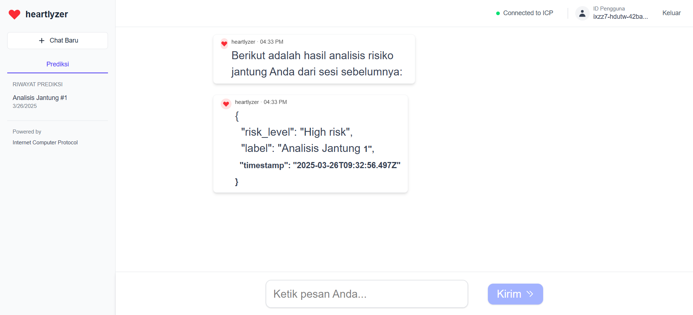

# Heartlyzer

Heartlyzer adalah aplikasi prediksi risiko serangan jantung yang dikembangkan menggunakan **Internet Computer (ICP)** dengan backend **Rust** dan frontend **React.js**. Aplikasi ini menganalisis dataset kesehatan yang berisi **3500 data** untuk memberikan prediksi berdasarkan berbagai faktor risiko. Sumber: **https://www.kaggle.com/datasets/ankushpanday2/heart-attack-prediction-in-indonesia**

## Fitur
- **Analisis Data Kesehatan**: Menganalisis dataset "Heart Attack Prediction in Indonesia" dengan 3.500 data untuk mengidentifikasi pola risiko serangan jantung.
- **Prediksi Risiko**: Menggunakan model analitik untuk memprediksi kemungkinan serangan jantung.
- **ICP Integration**: Backend berbasis **Rust** yang berjalan di **Internet Computer (ICP)** untuk kecepatan dan keamanan.
- **Frontend React.js**: UI yang interaktif dan responsif menggunakan **React.js**.

## Screenshot


## Teknologi yang Digunakan
- **Backend**: Rust dengan framework candid untuk ICP
- **Frontend**: React.js dengan Tailwind untuk tampilan
- **Data Processing**: Algoritma berbasis Rust untuk analisis data
- **Deployment**: Internet Computer (ICP)

## Instalasi & Penggunaan
### Prasyarat
Pastikan Anda telah menginstal:
- [DFX SDK](https://internetcomputer.org/docs/current/developer-docs/setup/install)
- Rust & Cargo
- Node.js & npm
- **WSL (Windows Subsystem for Linux)** jika menggunakan Windows

### Clone Repository
```sh
git clone https://github.com/username/heartlyzer.git
cd heartlyzer
```

### Pilih Terminal di VSCode (WSL atau Native)
Jika menggunakan **WSL**, pastikan terminal yang digunakan adalah **WSL** di VSCode sebelum menjalankan perintah berikut.

### Setup Backend (ICP + Rust)
```sh
open wsl in terminal VS Code
cargo build --release
```
Deploy ke ICP:
```sh
dfx start --background --clean
dfx canister create codefest_heartlyzer_backend
dfx canister create codefest_heartlyzer_frontend
npm install
dfx build
dfx deploy
```

### Setup Frontend (React.js)
```sh
cd frontend
npm update sass
npm update
npm start
```

Akses aplikasi di `http://localhost:3000`.

## Kontribusi
1. Muhamad Rizki
2. Ikay Bhaskara Narendra
3. Muhamad Rizki

## Lisensi
Proyek ini dilisensikan di bawah MIT License.

---
Dikembangkan oleh **MIM Team** ❤️

